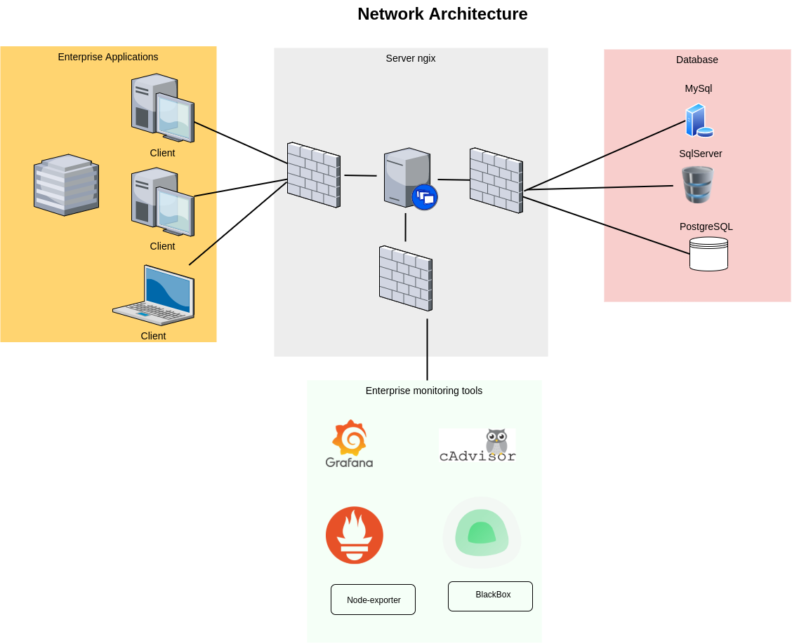

# Bienvenue dans ce repo de DevOps

Ce projet consiste à mettre en place un système de gestion d'une entreprise.  
Pour cela un ensemble d'outils a été mis en place, ainsi, ces outils se trouvant dans des dossiers "folders" seront listés ci-dessous.

- Proxy
- Applications
- Database
- Monitoring

  > `Rappelons que toutes les technos utilisées ici seront créés à partir d'un "docker-compose" car l'objectif est d'apprendre et d'utiliser docker. Donc  tout conteneurisé.`

## Proxy

Dans le dossier proxy il y a le nginx-proxy.

- nginx-proxy: est le proxy utilisé afin d'éviter d'acceder directement aux applications.

## Applications

Il contient les dossiers qui contiennent les applications, dedans vous trouverez:

- Ghost: Une plateforme de blogs gratuite et open source écrite en JavaScript <a style="text-decoration: underline; color:black"  href="https://hub.docker.com/_/ghost"> lien vers docker-hub</a>

- Gitea: Un service git en local que vous hebergez et manipulez comme une tasse de thé <a style="text-decoration: underline; color:black"  href="https://docs.gitea.io/en-us/install-with-docker/"> documentation</a>

- Portainer: Un container qui monitor des conteneurs, lien vers la doc 👉 <a style="text-decoration: underline; color:black" href="https://docs.portainer.io/v/ce-2.11/start/install/agent/docker/linux#deployment"> ici</a>

- FastAPI: Une application crée à partir du Framework fast-api de  python, lien vers la doc 👉 <a style="text-decoration: underline; color:black" href="https://medium.com/swlh/fastapi-microservice-patterns-application-monitoring-49fcb7341d9a"> ici</a>

- FLASK: Une application crée à partir du Framework flask-python, lien vers la doc 👉 <a style="text-decoration: underline; color:black" href="https://towardsdatascience.com/how-to-dockerize-an-existing-flask-application-115408463e1c"> ici</a>

## Database

Dans ce dossier il y a tous les serveurs et toutes les bases de données.

- MySQL: Je vous mets l'article que j'ai écris un article sur MySQL-docker-compose voici 👉 <a style="text-decoration: underline; color:black" href="https://soowcode.github.io/docker-mysql/"> le lien</a>
- PostgreSQL: À noté que dans 👉 <a style="text-decoration: underline; color:black" href="https://hub.docker.com/_/postgres"> docker hub </a> ils utilisent adminer, mais dans ce projet est utilisé pgAdmin 4.

- SQLSERVER: Un server SqlServer, pour plus d'informations 👉 <a style="text-decoration: underline; color:black" href="https://hub.docker.com/_/microsoft-mssql-server"> docker hub </a> ou le site de 👉 <a style="text-decoration: underline; color:black" href="https://docs.microsoft.com/en-us/sql/linux/quickstart-install-connect-docker?view=sql-server-ver15&pivots=cs1-bash"> microsoft</a>

## Monitoring

Dans ce dossier il y a  tout ce qu'il  faut pour monitorer les applications citées ci-dessus.
Pour le moment il contient prometheus, grafana, node-exporter, cadvisor, alertmanager, uptime-kuma,...

- prometheus
- grafana
- node-exporter
- cadvisor
- alertmanager
- uptime-kuma
- blackbox

